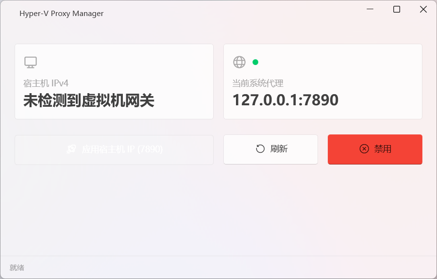

# HyperVProxyManager

轻量 GUI 工具，用于在 Hyper-V 虚拟机中管理代理设置。特点：
- 单文件发布，便于分发和使用。
- 充分简化代理设置方式，只包含“设置”与“禁用”两个功能。
- 通过 WPF-UI 实现的现代化界面，支持 Mica 效果。

## 界面截图

## 工作原理

- 使用默认连接方式时，Hyper-V 虚拟机会以宿主机的 IPv4 地址为 IPv4 网关。
- 通过扫描虚拟机的网络设置，获取 IPv4 网关地址，即可获取宿主机在虚拟局域网内的地址。
- 当虚拟机的代理提供程序支持局域网连接时，虚拟机可以设置其代理服务器为宿主机的虚拟局域网地址，从而实现代理功能。
- 本工具通过修改注册表来设置或禁用代理，通过 `wininet.dll` 通知系统代理设置更改。

## 注意事项

- 当前，本工具不允许修改手动修改代理服务器地址或端口。
- 仅支持 IPv4，不支持 IPv6。
- 本工具虽为单文件发布，但未包含运行时，需自行安装 .NET 10 桌面运行时。

## 更新历史

- v1.0.0 首个稳定版本。
- v1.1.0 使用 `LibraryImport()` 和源生成器替代 `DllImport()`。
- v1.1.1 修复系统库调用失败异常，并重构状态栏消息获取方式。

## 许可
[MIT 许可证](LICENSE)
