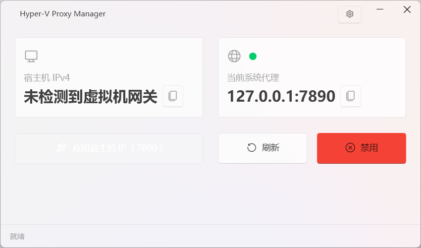
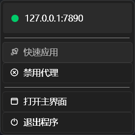

# HyperVProxyManager

轻量 GUI 工具，用于在 Hyper-V 虚拟机中管理代理设置。特点：

- 单文件发布，便于分发和使用。
- 充分简化代理设置方式，只包含“设置”与“禁用”两个功能。
- 通过 [WPF-UI](https://wpfui.lepo.co/) 实现的现代化界面，支持 Mica 背景和自动深色模式。

## 界面截图

主界面截图：

系统托盘菜单截图：

两张截图均在非 Hyper-V 虚拟机下获取，因此无法呈现代理设置功能。

## 工作原理

- 使用默认连接方式时，Hyper-V 虚拟机会以宿主机的 IPv4 地址为 IPv4 网关。
- 通过扫描虚拟机的网络设置，获取 IPv4 网关地址，即可获取宿主机在虚拟局域网内的地址。
- 当宿主机的代理提供程序支持局域网连接时，虚拟机可以设置其代理服务器为宿主机的虚拟局域网地址，从而实现代理功能。
- 本工具通过修改注册表来设置或禁用代理，通过 `wininet.dll` 的 [InternetSetOptionW](https://learn.microsoft.com/en-us/windows/win32/api/wininet/nf-wininet-internetsetoptionw) 函数通知系统代理设置更改。

## 注意事项

- 当前，本工具不允许修改手动修改代理服务器地址或端口。
- 仅支持 IPv4，不支持 IPv6。
- 本工具虽为单文件发布，但未包含运行时，需自行安装 .NET 10 桌面运行时。

## 程序构建

1. 自行下载安装 .NET 10 SDK。
2. Clone 本仓库到本地，并 cd 到仓库根目录。
3. 运行 `dotnet publish -c Release -r <ARCH> --sc false` 以发布不包含运行时的单文件应用程序。根据自身设备的CPU架构选择以下任意一项填入 `<ARCH>` 中：
    - `win-x64`
    - `win-x86`
    - `win-arm64`
4. 发布的文件位于 `bin\Release\net10.0-windows\<ARCH>\publish\` 目录下。

## 更新历史

- v1.0.0 首个稳定版本。
- v1.1.0 使用 `LibraryImport()` 和源生成器替代 `DllImport()`。
- v1.1.1 修复系统库调用失败异常，并重构状态栏消息获取方式。
- v1.3.0
    - 增加后台运行功能，关闭将会最小化到系统托盘。
    - 使用 [Hardcodet.NotifyIcon.Wpf](https://github.com/hardcodet/wpf-notifyicon) 提供系统托盘及其菜单，允许用户直接通过系统托盘菜单执行操作。
    - 更改窗口设置，禁止最大化并移除最大化按钮；同时不允许增加窗口到大于初始状态，缩小窗口不受影响。
    - 增加应用程序清单文件，更好地控制高分辨率屏幕下的表现。
- v1.3.1 修复多个程序同时运行问题。现在将只允许一个进程实例运行。
- v1.3.2 增加 `--background` 参数（大小写不敏感），允许程序启动时直接最小化到系统托盘。

## 许可
[MIT 许可证](LICENSE)
