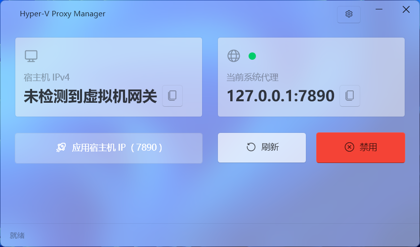
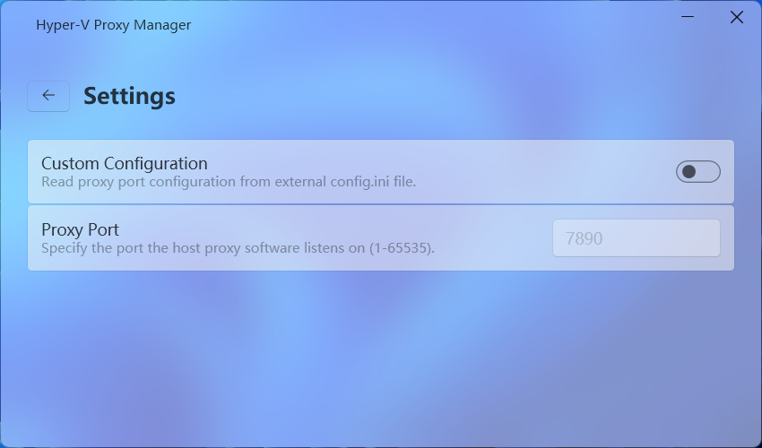
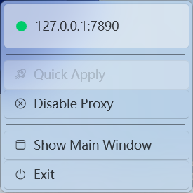
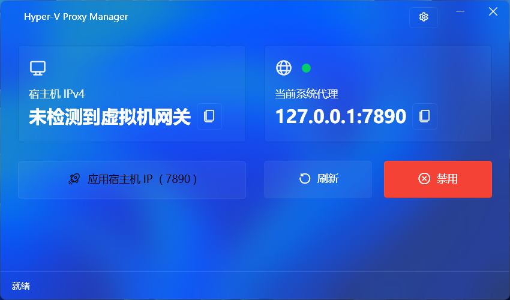
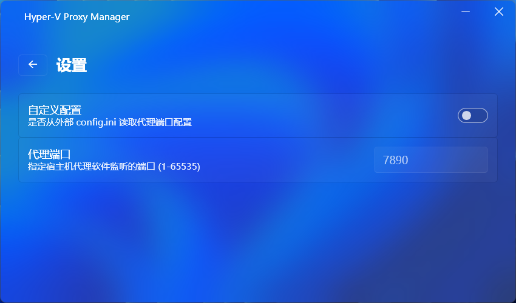
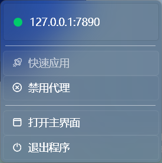

# HyperVProxyManager

轻量 GUI 工具，用于在 Hyper-V 虚拟机中管理代理设置。特点：

- 单文件发布，便于分发和使用。
- 充分简化代理设置方式，只包含“设置”与“禁用”两个功能。
- 通过 [WPF-UI](https://wpfui.lepo.co/) 实现现代化的界面，支持半透明背景和颜色模式切换。
- 使用自绘 UI 实现现代化的系统托盘菜单，支持半透明背景和颜色模式切换。
- 提供少量外部配置，增加适用性。

## 界面截图

1. 主界面（浅色模式 + 浅色Windows默认背景）截图：

2. 设置界面（浅色模式 + 浅色Windows默认背景）截图：

3. 系统托盘菜单（浅色模式 + 浅色Windows默认背景）截图：

4. 主界面（深色模式 + 深色Windows默认背景）截图：

5. 设置界面（深色模式 + 深色Windows默认背景）截图：

6. 系统托盘菜单（深色模式 + 深色Windows默认背景）截图：

（所有截图均在非虚拟机环境下获取，无法呈现部分按钮可用时的状态。）

## 工作细节

- 代理设置
    - 使用默认连接方式时，Hyper-V 虚拟机会以宿主机的 IPv4 地址为 IPv4 网关。
    - 通过扫描虚拟机的网络设置，获取 IPv4 网关地址，即可获取宿主机在虚拟局域网内的地址。
    - 当宿主机的代理提供程序支持局域网连接时，虚拟机可以设置其代理服务器为宿主机的虚拟局域网地址，从而实现代理功能。
    - 本工具通过修改注册表来设置或禁用代理，通过 `wininet.dll` 的 [InternetSetOption](https://learn.microsoft.com/en-us/windows/win32/api/wininet/nf-wininet-internetsetoptionw) 函数通知系统代理设置更改。
 - UI 绘制
    - 主界面继承自 `Wpf.Ui.Controls.FluentWindow` 类，原生支持半透明 backdrop 效果和 WinUI 3 风格 UI 控件；通过将窗口扩展至标题栏，实现对标题栏的完全自定义。
    - 系统托盘图标继承自 `Hardcodet.Wpf.TaskbarNotification.TaskbarIcon` 类，但仅用于控制图标的表现
    - 实际托盘菜单为自定义窗口，通过继承 `System.Windows.Window` 类并使用 WPF-UI 控件，实现现代化且生命周期独立的菜单窗口。其目的是使托盘菜单和主界面的生命周期解耦，在后台启动时托盘菜单可以独立运行。
        - 通过组合使用 `SingleBorderWindow` 的窗口设置、 `WindowChrome` 类和 [SetWindowLong](https://learn.microsoft.com/en-us/windows/win32/api/winuser/nf-winuser-setwindowlongw) 函数，将窗口控件完全隐藏的同时保留完整窗口视觉效果；
        - 通过调用 `User32.dll`、`SHCore.dll` 中的函数，手动设置托盘菜单的位置，并考虑到 HiDPI 和屏幕缩放的影响。
- 配置持久化
    - 使用 [Microsoft.Extensions.Configuration.Ini](https://learn.microsoft.com/en-us/dotnet/core/extensions/configuration-providers#ini-configuration-provider) 库加载和保存外部配置文件 `config.ini`，实现配置持久化。
    - 默认配置被硬编码于程序之中，当外部配置文件缺失或配置项不合法时，将使用默认配置。
    - 程序退出时，会将当前配置保存到外部配置文件中，并覆盖原有配置文件的所有内容。
    - 读取和保存配置时的任何错误都会被忽略，目标是优先保证程序的正确运行。
- Win32 互操作
    - 使用 [CsWin32](https://github.com/microsoft/CsWin32) 将 Win32 API 投影为 C# 方法。

## 注意事项

- 仅支持 IPv4，不支持 IPv6。
- 本工具虽为单文件发布，但未包含运行时，需自行安装 .NET 10 桌面运行时。

### 已知问题

- 由于使用了 WPF-UI 并通过它开启了半透明 backdrop 效果，本程序已验证无法在 Windows 10 21H2上运行。其他 Windows 版本尚未验证。
    - 解决方法：无。
- 由于未确认的 WPF-UI 的 Bug，v1.4.4 版本开始将无法跟随系统主题更改程序主题。
    - 解决方法：在系统主题更改后，手动退出程序并重新启动

## 程序构建

1. 自行下载安装 .NET 10 SDK。
2. Clone 本仓库到本地，并 cd 到仓库根目录。
3. 运行 `dotnet publish -c Release -r <ARCH>` 以发布不包含运行时的单文件应用程序。根据目标虚拟机的CPU架构选择以下任意一项填入 `<ARCH>` 中：
    - `win-x64` 对于64位的 Windows 系统
    - `win-x86` 对于32位的 Windows 系统
    - `win-arm64` 对于 ARM64 架构的 Windows 系统
4. 发布的文件位于 `bin\Release\net10.0-windows\<ARCH>\publish\` 目录下。

### 本地化

本程序使用标准的 .resx 文件存储字符串资源并进行本地化，默认语言（英语）文件是 `Resources/l10n.resx`。可以通过添加新的 `l10n.*.resx` 文件来支持更多语言。

目前，本程序不支持热切换语言。程序会在启动时读取系统语言，自动确定将使用的语言。当系统语言不受支持时，将回退到默认语言（英语）。

当前支持语言：en, zh-Hans。

## 更新历史

- v1.0.0 首个稳定版本。
- v1.1.0 使用 `LibraryImport()` 和源生成器替代 `DllImport()`。
- v1.1.1 修复系统库调用失败异常，并重构状态栏消息获取方式。
- v1.3.0
    - 增加后台运行功能，关闭将会最小化到系统托盘。
    - 使用 [Hardcodet.NotifyIcon.Wpf](https://github.com/hardcodet/wpf-notifyicon) 提供系统托盘及其菜单，允许用户直接通过系统托盘菜单执行操作。
    - 更改窗口设置，禁止最大化并移除最大化按钮；同时不允许增加窗口到大于初始状态，缩小窗口不受影响。
    - 增加应用程序清单文件，更好地控制高分辨率屏幕下的表现。
- v1.3.1 修复多个程序同时运行问题。现在将只允许一个进程实例运行。
- v1.3.2 增加 `--background` 参数（大小写不敏感），允许程序启动时直接最小化到系统托盘。
- v1.4.0 重构系统托盘及其菜单的架构，使用自绘 UI 重写托盘菜单的外观，实现更现代化的视觉效果。
- v1.4.1 修复后台启动时托盘菜单无法正确获取代理状态的问题。
- v1.4.2 修正按钮 UI 元素的互斥关系，避免出现应用和禁用代理按钮同时可用的状态。
- v1.4.3 优化托盘菜单的渲染模式，确保窗口内容对齐到物理像素；同时更新托盘菜单位置计算逻辑。
- v1.4.4 更新依赖。
    - WPF-UI: 4.1.0 -> 4.2.0；
    - Microsoft.Extensions.DependencyInjection: 10.0.1 -> 10.0.2。
- v1.5.0 增加外部配置和设置页面，允许用户自定义代理服务器端口。
- v1.5.1 更改外部配置文件的定位方法，解决单文件打包时配置文件被生成在 `%Temp%` 目录下的问题。
- v1.5.2 更新依赖
    - Microsoft.Extensions.Configuration.Ini: 10.0.2 -> 10.0.3；
    - Microsoft.Extensions.DependencyInjection: 10.0.2 -> 10.0.3。
- v1.5.3
    - 更新依赖
        - Microsoft.Extensions.Configuration.Ini: 10.0.3 -> 10.0.5；
        - Microsoft.Extensions.DependencyInjection: 10.0.3 -> 10.0.5；
        - Microsoft.Xaml.Behaviors.Wpf: 1.1.135 -> 1.1.142。
    - 更新用户界面：在主界面显示的两个IP地址附近增加复制按钮，以将其复制到剪贴板。
- v1.6.0
    - 更新依赖
        - CommunityToolkit.Mvvm: 8.4.0 -> 8.4.1。
    - 使用 CsWin32 替代手动导入 Win32 API。
    - 使用 Partial Property 替代 Field，优化 CommunityToolkit.Mvvm 的 ObservableObjectAttribute 效果。
    - 对特定 Win32 API 抑制平台兼容性检查。
- v1.6.1
    - 优化服务层代码，改进代理配置服务。
    - 优化 Dashboard ViewModel，为状态信息显示增加自动恢复初始状态的功能，并修复了不同操作之间相互干扰的问题。
- v1.7.0
    - 更改程序主界面半透明 backdrop 效果类型：由 Mica 变更为 Acrylic。
    - 为系统托盘上下文菜单窗口增加半透明 backdrop 效果：Acrylic。
    - 更改程序界面中部分 UI 组件的背景效果与样式，以和新的 backdrop 效果相匹配。
- v1.7.1 修复为托盘菜单引入半透明效果后，菜单窗口控件未全部隐藏的问题。
- v1.7.2
    - 更新依赖
        - CommunityToolkit.Mvvm: 8.4.1 -> 8.4.2。
    - 为所有 UI 字符串增加本地化支持，并完成了英语和中文（简体）翻译。

## 许可
[MIT](LICENSE)
